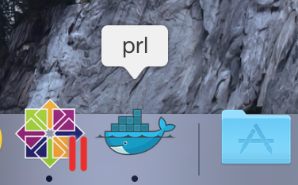

Parallels Icon Pack
===================

Extra OS X dock icons suited for use with
[Parallels Desktop for Mac](http://www.parallels.com/products/desktop/) VMs.



Build
-----
Icons (.icns) are built to the out/ directory using the iconutil, available
from _XCode_.

Build a icon with:
```make <icon>```

or all with:
```make all```

The original _.png_ files can be found in original/ and iconsets in iconsets.
The iconsets have been created from the originals with
[Icon Glue](http://www.wrench.at/en/IconGlue/).

Usage
-----

Overwrite the ```<vm>.pvm/<vm>.app/Contents/Resources/WinAppHelper.icns```
with your desired icon.
